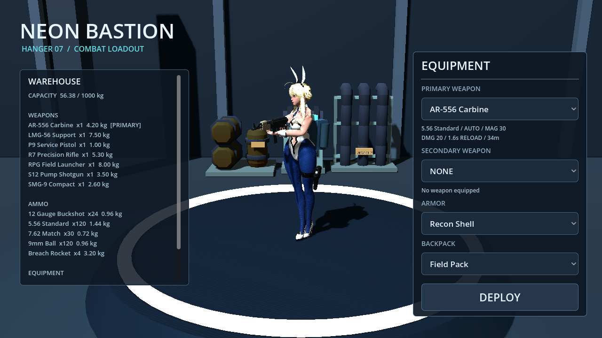
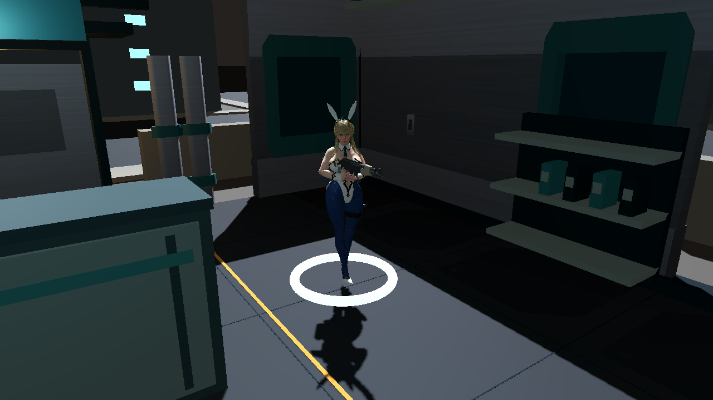
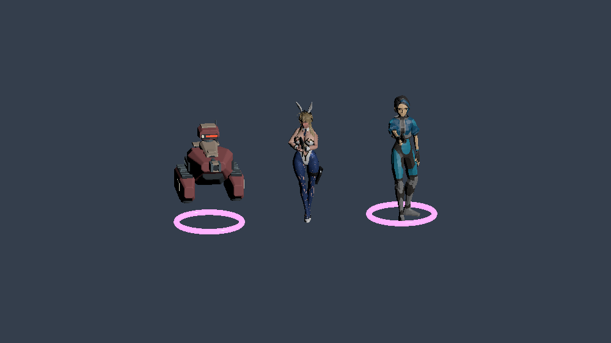

# 无围巾 Bunny Suit 主角试装

2026-09-30｜Godot 4.7.2 / GL Compatibility｜当前工作树，尚未提交

**结论：适合用作当前内部 demo 的主角试装。** 已在 Hanger 和 Battle 中替换可见主角。Bunny Suit 本身没有盔甲版的披风和毛领；另外隐藏了独立长围巾，保留兔耳、连体服、长袜、鞋和默认头发。肩、腰与持枪轮廓更清楚，减少了服装遮挡枪械和腿部动作的问题。





第二张是实际战斗场景中的玩家，使用检查镜头；正常俯视摄影机见 [自动路线截图](artoria_bunny_trial/route/02_entrance.png)。没有把检查镜头冒充正常游戏视角。

## 已接入的内容

- 七把现代武器共用现有战斗逻辑，适配新身高、挂点、手掌方向与手指；奔跑、瞄准、射击、换弹、切枪和翻滚保持可用。修复翻滚时动作混合把左手抬离枪身的问题，并测量修改器执行后的实际手腕位置。
- 沿用 Unity-Chan 的隐藏动画驱动，导入角色经过骨骼重定向；原始 Unity-Chan 几何、贴图和 FBX 动画不改。当前不是一套专为 Bunny 制作的新动作库。
- 普通巡逻敌人改用在库 Quaternius SciFi 的人型网格、蒙皮、手枪及移动/射击/死亡动画；重型敌人保留 KITE 无人机。初始战区为 9 名人型与 3 台重型无人机，增援也包含两类。
- 人型敌人死亡保留源模型并播放原有死亡动画。主角死亡保留整套蒙皮模型并倒下；没有用程序化方块人体替代。主角倒地是姿势与整体变换动画，尚非物理布娃娃。
- 机库主光和补光降低，减少新 PBR 模型的曝光溢出。头发高光与皮肤的最终表现仍需材质和灯光打磨。



该图是独立检查台。实际战区混合出生、伤害、死亡和导航由回归覆盖；人型与无人机目前共用大部分 AI 行为，外观多样化不等于已经实现故事中的全部敌人类型。

## 资产处理

| 项目 | 当前结果 |
|---|---|
| 原文件 | 用户 Downloads 中的 `ArtoriaLancer_AllVersion_ARP_MustardUI.blend`；从未覆盖保存 |
| 原文件 SHA-256 | `1fa53fe6e60a54c4243b2a8dc2b656bf2f4d3c3080fc69cbdf05c4495ccda06a`，导出后复核一致 |
| 选中原始 Bunny 版本 | 去围巾后 259,994 三角形；对应衣装的身体 fit 形态已应用 |
| 当前显示模型 | **157,293 三角形、11 个蒙皮网格、52 根显示骨骼**；隐藏动画源骨架另计 |
| 简化范围 | 仅头发保留 40% 三角形；身体、面部和衣装保留原几何，蒙皮权重归并到源参考关节 |
| 材质 | 从源节点烘焙的 PBR 贴图；便携材质近似源 Blender 效果，不是无损着色器复刻 |
| 运行文件 | `assets/characters/artoria_bunny/bunny_player.glb`，44,361,788 字节，约 42.3 MiB，完整内嵌贴图 |
| 冷导入 | 内嵌纹理导入模式 3；不依赖先前缓存生成的外部 PNG |

转换脚本、源映射与重建方式见 [art_source README](../art_source/artoria_bunny/README.md) 和 [导出报告](../art_source/artoria_bunny/export_report.json)。运行游戏不要求本机存在原 blend，也不要求安装 Blender。

## 实际验证与边界

| 验证 | 结果 / 证据 |
|---|---|
| 全新副本冷导入 | 0 ERROR / 0 WARNING；[日志](artoria_bunny_trial/regression/cold_import.log) |
| 35 个回归场景 | 全部 PASS；[原始结果](artoria_bunny_trial/regression/results.json)，包括新增角色/死亡/翻滚握持测试 |
| 正常入口 | exit 0 / 0 ERROR；有一条已有的 ObjectDB 退出泄漏警告，不声称 warning-free |
| 源快照一致性 | 最终测试后，664 个运行/测试文件 SHA-256 均未改变；[核对记录](artoria_bunny_trial/runtime_snapshot_check.json) |
| 七枪图形检查 | 全部经过真实 Hanger 与 Battle 玩家；[日志](artoria_bunny_trial/weapons.log)，`weapons/` 保留 16 张截图 |
| 动作图形检查 | 奔跑转向、射击、换弹、翻滚与恢复；[日志](artoria_bunny_trial/motion.log)、[翻滚截图](artoria_bunny_trial/motion/phase_06.png)。脚本 PASS 是流程检查，另行查看了截图 |
| 正常 AI 图形路线 | 13 项通过：开门、室内通行、终端可达、出门、撤离、Result；57 发、受到 3 点伤害、0 击杀，`mission_completed=false`。[结果](artoria_bunny_trial/route/route_result.json) |

最后一次整套回归中的旧路线脚本曾卡门框：[失败记录](artoria_bunny_trial/initial_route_failure/route_result.json)。原因是脚本朝 x=-17.1 的铰链走，门洞中心是 x=-16；只改正验证路线坐标，未移动墙、关闭碰撞或削弱 AI。修正后在相同运行文件上，用新的独立存档重跑路线通过。原始 `regression/results.json` 保留首次路线失败；[最终汇总](artoria_bunny_trial/final_validation.json) 单独记录修正后的结果。

这里完成的是自动化流程与图形检查，未宣称人工通关、完整任务完成或性能验收。各项验证均在项目外副本和独立 `user://` 中运行，没有用个人存档做测试。

复现全套：

```sh
python3 tools/verify_migration.py --godot /Applications/Godot.app/Contents/MacOS/Godot --output /tmp/bunny-verification-new --route
```

在导入完成的独立副本内设置 `VISUAL_SLICE_CAPTURE_DIR` 或 `VISUAL_COMBAT_CAPTURE_DIR`，分别运行同名图形测试，可保存七枪和动作截图。`tools/artoria_rig_probe.gd` 提供独立角色对照检查台。

## 下一步真正还缺什么

1. **动作与材质精修**：现有重定向有步态/脚底滑动、武器间手指贴合的细节差异；没有面部动画、眨眼、发丝/衣料物理。头发高光在强光下仍明显，不能称为最终角色质量。
2. **统一美术与性能预算**：主角精度明显高于低模 PMC、无人机和场景；目前无 LOD，也没完成低端设备帧率、内存和加载时间测量。15.7 万三角形是试装数据，不是优化完成的证明。
3. **商业原创角色资产**：本地 Artoria 文件没有随附明确许可，角色身份也不是原创陆栖。当前试装不代表可直接用于商业发行。Quaternius 本地许可标题 Males 与旧来源 Women 链接也有继承的来源不一致，已记录在 [第三方资产表](../THIRD_PARTY_ASSETS.md)，尚未做源包字节匹配。
4. **可试玩 Demo 的内容**：操作引导、成长收益、任务节奏和异常恢复仍按 [Demo 缺口审查](DEMO_READINESS_2026-09-28.md) 推进；新模型没有替代这些工作。

[原创剧情制作包](narrative/README.md) 已交付全部十七部分；其中十二章、八个 Boss 与角色演出仍是待制作内容。本次没有把剧情文件计作已实现关卡。
