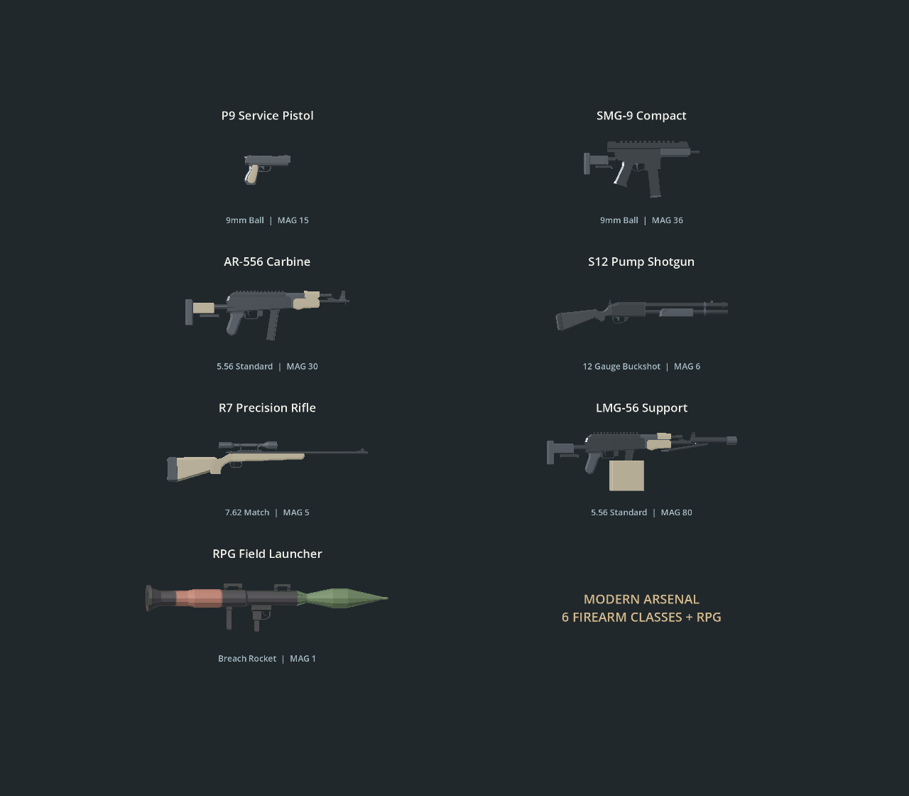
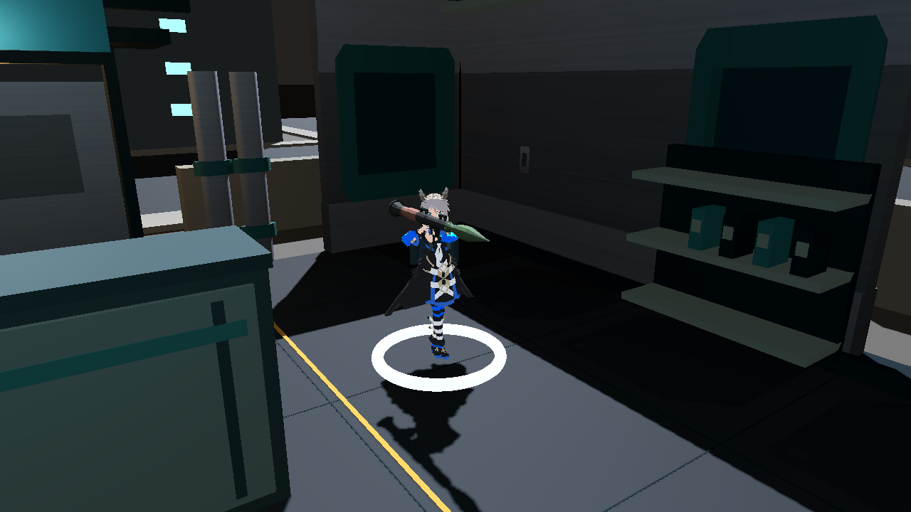

# 现代武器套装 · 2026-09-29

已接入六类现代枪械，并保留独立模型、独立贴图的 RPG。七把武器均可在 Hanger 装到主、副武器槽，使用真实枪口和双手握点；仓库滚动列表及武器详情展示弹种、弹匣、伤害、换弹时间和射程。



| 类别 | 名称 | 弹药 | 弹匣 | 基础伤害 | 射程 | 换弹 | 玩法 |
|---|---|---|---:|---:|---:|---:|---|
| 手枪 | P9 Service Pistol | 9mm | 15 | 22 | 23m | 1.15s | 每次按下扳机一发，移动轻快 |
| 冲锋枪 | SMG-9 Compact | 9mm | 36 | 10 | 18m | 1.35s | 自动连射，14 发/秒 |
| 突击步枪 | AR-556 Carbine | 5.56 | 30 | 20 | 34m | 1.6s | 自动连射，中距离通用 |
| 霰弹枪 | S12 Pump Shotgun | 12 Gauge | 6 | 12 × 8 | 17m | 2.8s | 一发弹药、八颗散布弹丸，近距离爆发 |
| 狙击枪 | R7 Precision Rifle | 7.62 | 5 | 88 | 55m | 2.2s | 单发、护甲穿透；按住 Shift 扩大前方观察范围 |
| 轻机枪 | LMG-56 Support | 5.56 | 80 | 18 | 36m | 3.2s | 大弹匣、自动射击、1.5° 散布，移动较慢 |
| 火箭筒 | RPG Field Launcher | Rocket | 1 | 92 | 30m | 2.7s | 单发投射物、范围伤害、破坏屏障 |

数值是游戏平衡参数。护甲穿透通过原有 DamagePacket 生效，不代表穿墙。霰弹按每颗弹丸分别结算护甲和结构伤害。狙击观察为俯视相机视野扩展，不是第一人称瞄准镜。

## 弹药和旧档

- 手枪/冲锋枪共用 9mm；步枪/轻机枪共用 5.56。新增 12 Gauge、7.62，保留火箭弹。
- 新口径进入战利品表；部署仍携带所选武器对应的仓库弹药。
- 读取旧存档时补入缺少的现代枪械及新增口径起始弹药，保留原有实例 ID、数量、装备选择及 schema 1。重复读取不重复赠送。
- 换弹时间按武器定义执行，HUD 显示剩余时间；切到副武器可开火，再切回不能绕过主武器换弹。
- 保留现有出击时装满弹匣、撤离时回收余弹的基础规则；先前 demo 审计所指出的免费满弹匣经济问题不在本次改动中。

## 美术来源

- 当前 AR 使用用户提供的 MoCap Online M4，Standard License（非 CC0）；运行时模型比例为 0.9，原始 FBX 与贴图未改动。来源见 `assets/weapons/mocap_m4/SOURCE.md`。
- 其余五种基础枪型的原始来源为 Quaternius Ultimate Guns Pack，CC0；轻机枪是基于突击步枪增加弹箱、重枪管和折叠两脚架的项目衍生模型。步枪与冲锋枪补了枪托，统一石墨、钢和沙色材质。详见 [枪械来源](../assets/weapons/modern_arsenal/SOURCE.md)。
- RPG 来自 Khairul Hidayat 的独立模型包，保留原 UV 和筒身/弹头贴图，详见 [RPG 来源](../assets/weapons/khairul_launcher/SOURCE.md)。
- 原始源文件、Blender 导出脚本和尺寸/握点记录在 `art_source/modern_arsenal/`。旧 Kenney 模型保留为参考，已退出七把生产武器场景。
- 角色模型和源动画未重做。当前共用已有上半身换弹动作，按枪调整握点和时长；尚无逐枪拆弹匣、逐发装填或拉栓动画。新增枪声为可复现的合成 demo 音效。

## 验证

环境：Godot 4.7.2，macOS / Apple M5，GL Compatibility。所有运行均使用独立项目名称和测试存档，未操作日常游戏存档。

- 全新无缓存导入：0 ERROR / 0 WARNING。
- 34 / 34 场景通过，所有测试 0 ERROR / 0 WARNING；包括七把武器的左右手握点误差 < 1cm。
- 新测试覆盖单发/自动扳机、一次消耗一发的八弹丸物理命中、狙击远距命中与观察相机、轻机枪换弹防切枪跳过、旧档迁移和重复迁移幂等性。
- 实际图形渲染检查：七把武器分别通过 Hanger 和 Battle 场景；RPG 持枪图见下。
- 正常敌人 AI 开启的自动输入路线通过进门、穿越办公室、返回撤离、进入 Result；这是提前撤离路线，不代表完成所有任务目标。共射击 60 发，受到伤害 6。
- Main 启动退出成功、无错误；定帧退出仍有 2 个 ObjectDB 实例未释放的原有告警。
- 证据：[测试结果](modern_arsenal/test_results.json)、[路线结果](modern_arsenal/route_result.json)。这是工作区验证，未声明已提交或推送。



复现：

```sh
python3 tools/verify_migration.py --godot /path/to/Godot --output /tmp/bunny-modern-new
# 在上述独立副本中渲染武器对比图
MODERN_ARSENAL_PREVIEW=/tmp/arsenal.png /path/to/Godot --path /tmp/bunny-modern-new/project --rendering-method gl_compatibility --script res://tools/modern_arsenal_preview.gd
```
