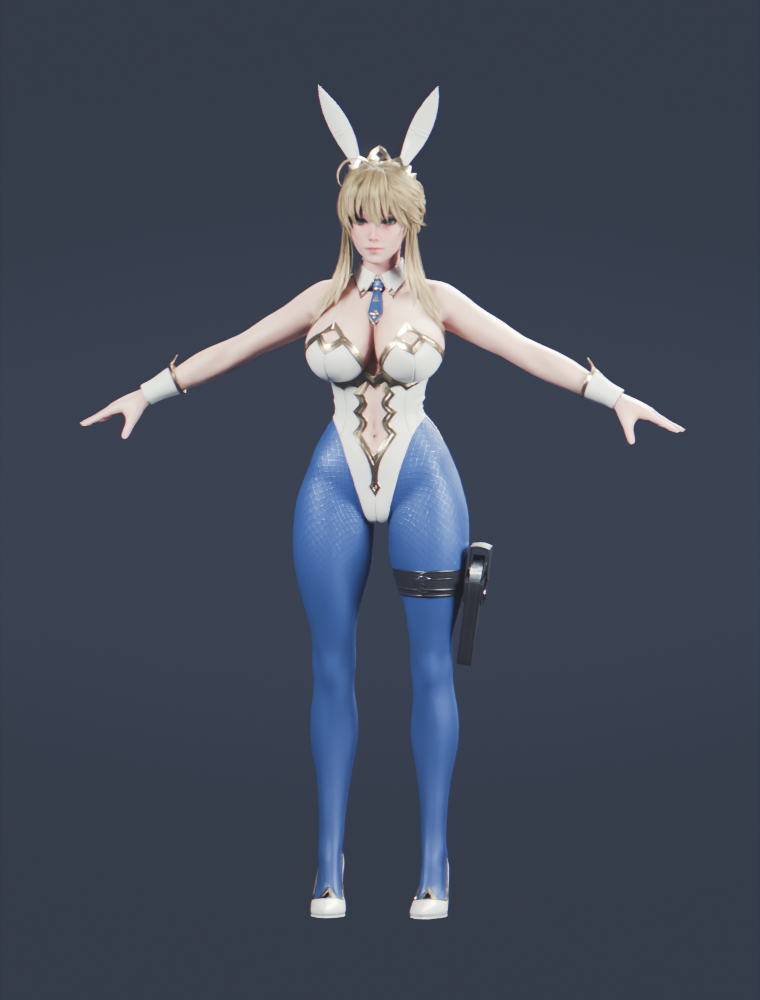
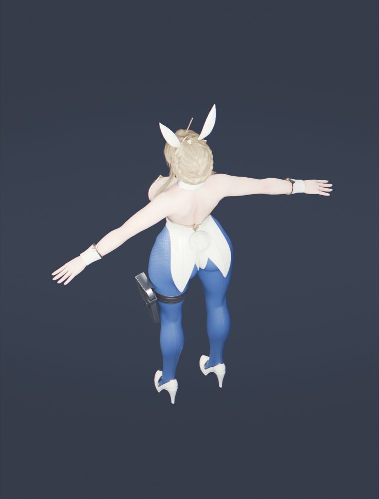
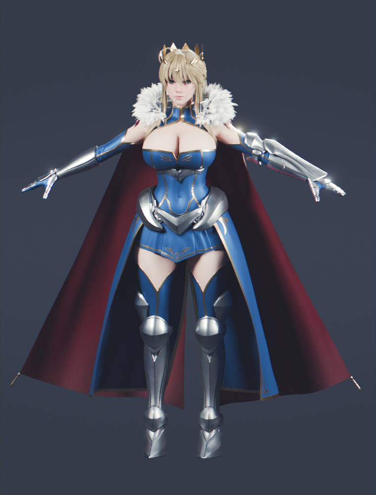
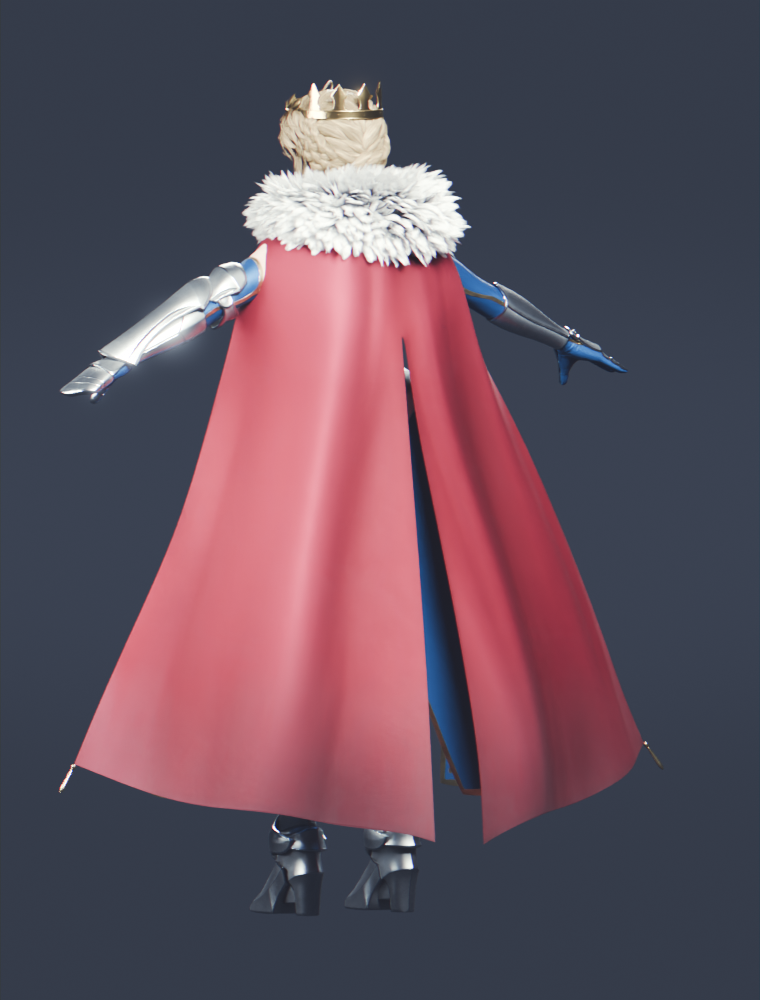
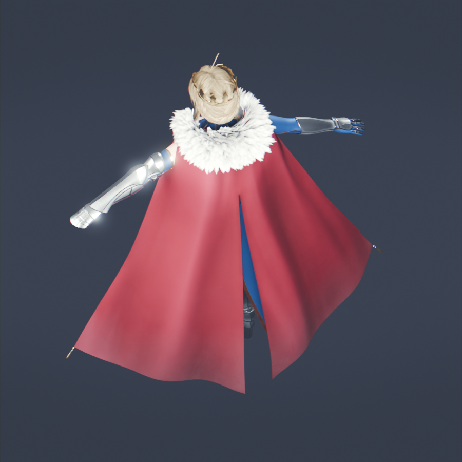

# Artoria Lancer 模型检查

2026-09-29，仅检查指定的 Blender 文件。原文件未保存覆盖，未替换游戏角色；以下图是 **Blender 原材质渲染**，不是 Godot 实机效果。完整数据见 [assessment.json](assessment.json)。

## Bunny Suit 补充检查

确认有 `ArtoriaLancer Bunny Suit` 版本，包含独立的兔耳、连体服、丝袜、高跟鞋、领饰、腕饰、腿带、尾巴和围巾。没有默认铠甲版的大披风、冠冕和毛领；兔女郎集合里的长白围巾（Scarf）仍需单独关闭。

同一默认发型、身体和眼睛下的基础几何比较：

| 装束 | 可见 Mesh | 基础三角面 | 相对铠甲版 |
|---|---:|---:|---:|
| 默认铠甲 | 18 | 334,846 | 基准 |
| 兔女郎，含围巾 | 12 | 261,978 | 减少 21.8% |
| 兔女郎，关闭围巾 | 11 | 259,994 | 减少 22.4% |

建议优先用**无围巾兔女郎版**做试装：俯视背面时腿部、腰部和双臂轮廓清晰，也少了披风/围巾与持枪、翻滚动作互相穿插的问题。兔耳在远镜头中提供明显的角色识别点。以上是静态预览判断，持枪和动作穿模尚未实测。

换装之后头发仍有 171,168 三角面，占无围巾版约 66%；原控制骨架和材质也没有自动变轻。后续仍需精简头发、导出游戏用变形骨架，并适配现有动作。高跟鞋的脚底接地需要在动作测试时检查。

这里仅在内存中切换服装集合、启用对应服装适配形态键、隐藏 Scarf，并以原材质渲染；没有覆盖源文件，也没有替换游戏主角。

## 判断

值得作为主角候选：面部、金属铠甲、布料和头发细节完整，约 1.80m 的尺寸合理，已带蒙皮、UV、面部形态键和多套服装。这更适合“幻想角色使用现代枪械”的方向。默认王冠、铠甲、长披风的视觉语言与现代战术服不同，需要作为主动的风格选择。

接入工作主要在运行资产优化和动作适配。当前工程是约 938 MiB 的多版本角色源文件，体积不等同于最终游戏资源体积。

| 检查项 | 实测结果 | 对游戏的意义 |
|---|---|---|
| 默认装束 | 18 个可见 Mesh，334,846 基础三角面 | 约为当前主角 37,359 三角面的 9 倍；不是实测帧率差距 |
| 头发 | 171,168 三角面 | 占默认版本约一半，优先降低几何密度 |
| 披风毛领 | 50,308 三角面 | 与头发合计约 66% 的基础面数，适合做简化版 |
| 主骨架 | 1,083 根骨，523 根标记为变形骨，665 个驱动器 | 应为 Godot 导出精简变形骨架；Blender 控制器和驱动器需要烘焙/重建 |
| 默认材质 | 13 个材质，节点递归引用 67 张图 | 有混合、曲线和节点组，需转换/烘焙到游戏材质；引用包含可能未启用的分支 |
| 全文件贴图 | 162 个图像数据块，其中 160 个已打包，多为 2K/4K | 没发现需要外部文件但已丢失的贴图；可从源文件整理依赖 |
| 表情与动作 | 身体 72 个、眼睛 52 个形态键（含 Basis/服装适配），多套走路 Action 和静态 Pose | 表情基础丰富；未识别出完整的持枪、奔跑、翻滚、换弹动作集 |
| 当前材质有效性 | 默认装束材质节点未发现 Undefined 节点，Cycles 能成功渲染 | 证明源文件可渲染；不能据此声称可无损导入 Godot |

## 当前游戏视角的注意点

接近游戏相机俯角的背面渲染中，披风占据大部分轮廓，遮住腿部。实际持枪动画尚未测试，但手臂和武器的可读性值得优先验证。若选择铠甲方案，试装建议保留脸、身体和铠甲，减少头发/毛领密度，使用短披风或去披风版本，然后适配现有 locomotion 与枪械 IK。

本次未找到该文件附带的授权文档，也没有内嵌 Text 文档；公开发布前应另行确认来源与使用许可。本检查不认定该文件可商用。

## 预览

默认铠甲正面：

默认铠甲背面：

接近当前游戏相机俯角的背面（仍为 Blender A-pose 检查图）：

