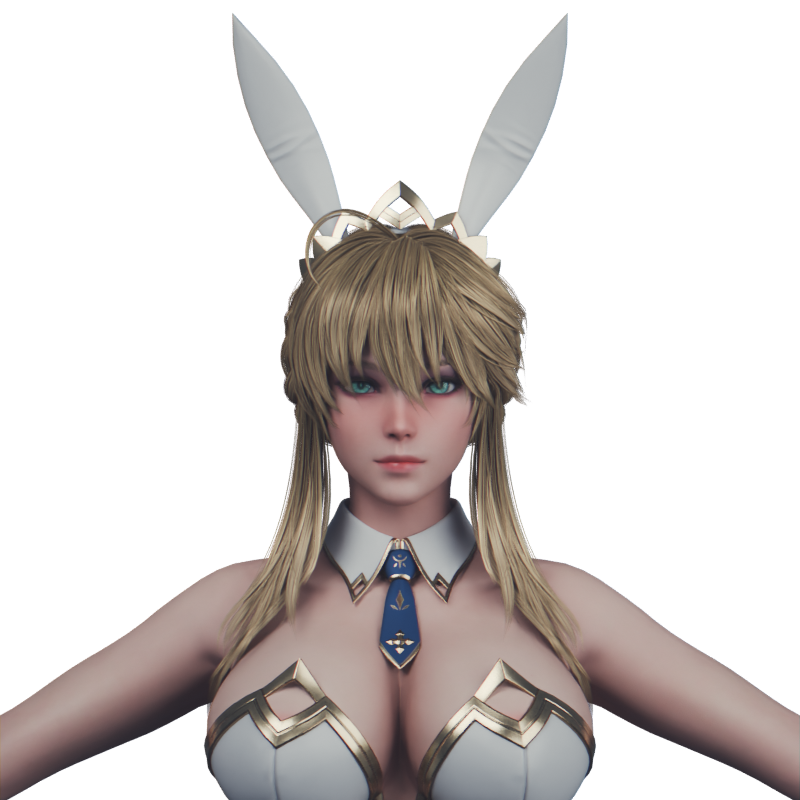
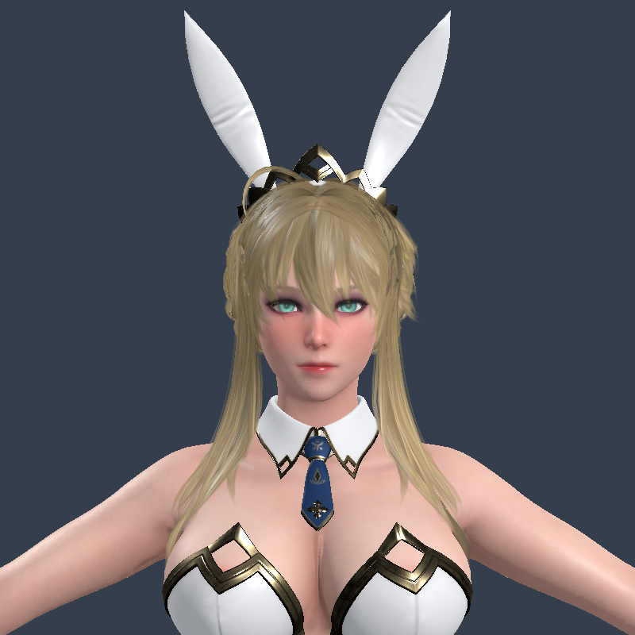

# Artoria 脸色与脸型差异检查

2026-09-30。用户反馈：脸/身体色差，游戏中脸型改变，精致感不足。本次只做隔离诊断；没有覆盖源 blend、重导出生产 GLB、修改游戏材质或切换项目渲染器。

## 结论

当前接入保住了面部基础几何，但没有完整保住原材质和展示质量。不能把这些差异简单归为“实时游戏必然粗糙”或“Godot 不行”。之前的 35 项回归是功能验收，不是美术保真验收。

| 检查 | 实测结果 | 判断 |
|---|---|---|
| 面部顶点 | 原 Head 材质 8,344 个顶点；glTF 包含 UV/法线边界拆点后 8,472 个。变换到同坐标系，逐点匹配最大位置误差 `1.43e-8 m` | 静态导出没有改变面部轮廓；这不是动画态逐帧蒙皮验证 |
| 腮红 | 源头部 `Value=1.0` 连接基础肤色与 Blush 纹理的混合系数 | 满值腮红被烘进当前头部颜色；身体无对应腮红。原 Cycles 近景也可见脸偏红 |
| 皮肤 | 源面部和身体均使用 Subsurface Weight=1；导出仅保留普通 PBR 基础参数 | 源皮肤的柔和透光与明暗过渡丢失。脸和身体受光方向不同，会进一步放大接色差异 |
| 头发 | 原 171,168 三角形减至 68,467；源 Anisotropic=1，另有 Specular 曲线/颜色 | 发片轮廓和原高光并未完整保真；当前普通透明材质的层叠表现也与 Cycles 不同 |
| 眼睛 | 源有角膜材质、虹膜发光与高光控制；导出角膜被近似成 alpha=.08 的普通壳，未复制眼睛发光 | 眼部通透和细节层次缩水；不应靠简单提高全脸亮度补偿 |
| 贴图与画面采样 | 源多为 2K/4K；面/体基础色烘至 2K，法线等为 1K；项目未显式启用 3D MSAA | 远景像素不足与透明发片边缘会损失细节；不能只靠增加多边形补回 |
| 游戏摄影 | 机库全身展示、倾斜角度、较小脸部像素面积，方向主光与补光；没有建立中性保真基准 | 强高光和阴影会改变鼻、颧骨、下颌的视觉体积 |

原几何核对见 [geometry_check.json](geometry_check.json)；原材质参数、修改器和头部边界见 [source_audit.json](source_audit.json)。皮肤色差不能全部归因于腮红；材料差异和场景受光是同时存在的因素。

## 实际近景

都用正面正交摄影机，中心高度 1.63 m、画幅高度 0.68 m、800×800。Blender 使用面积光/Cycles，Godot 使用方向光；这里对齐构图，**没有宣称光照能量或两套渲染器逐像素一致**。

| 原始 Blender 材质 | 当前导出 GLB，在 Godot 中性灯光下 |
|---|---|
|  |  |

同一 GLB 换成近景与中性光，已比现有机库小画幅截图更容易辨认原脸型。这说明不能仅凭机库截图判断网格变形；也不能因为静态几何相同，就认为外观还原合格。

## 隔离试验，不是已交付的美化

执行了关闭法线、灰模、皮肤漫反射/发片透明方式试验，并在 Apple M5 上实际启动了 Forward+ / Metal。示例见 `godot_no_normal.png`、`godot_clay.png`、`godot_skin_wrap.png`、`forward_baseline.png`、`forward_skin_wrap.png`。后两张分别为切换渲染器与 AgX，以及追加临时 SSS/头发各向异性/MSAA 等参数。

临时 SSS 试验存在脸部过软、眼部偏亮；不能把这组未校准参数当作最终修复。**只切换渲染器不会自动恢复原 Blender 材质。**

Godot [渲染器功能表](https://docs.godotengine.org/en/stable/tutorials/rendering/renderers.html)列明：Compatibility 不提供 StandardMaterial 的次表面散射，Forward+ 提供；Forward+ 同时提供 HDR 精度和更多抗锯齿方案。发片透明与抗锯齿设置见[官方材质文档](https://docs.godotengine.org/en/stable/tutorials/3d/standard_material_3d.html)。

## 建议的修复顺序

1. 先建立角色保真样板：固定正/侧脸、锁定相机和中性光，明确腮红强度；保留脸部几何与近景头发，另做远景 LOD。
2. 重做材料转换：统一面/体皮肤响应，把 AO、基础色与 SSS 分开处理；还原眼睛层次、发片透明和头发高光；不要用全脸染色掩盖色差。
3. 以桌面画质为目标时采用 Forward+，结合准确材质配置 SSS、抗锯齿、反射和色调映射，然后迁移回机库和战区。现有低模场景也要校准，不能仅换一个开关。
4. 再验收动画态面部比例和表情。通过这些画面检查后，再做目标机器性能测试，决定发片、贴图和 LOD 预算。

本次没有修改运行代码，因此没有把之前的回归结果冒称为新一轮美术修复验证。
