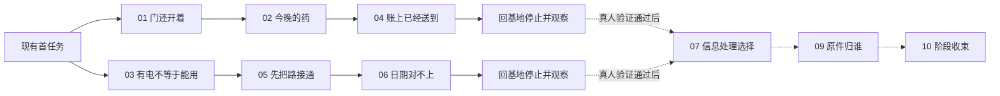

# Alpha 任务与叙事设计提案

2026-10-06 评审修订。基于 `c1cebae` 的可玩系统与现有《别替我签字》故事设定，设计城区阶段的委托网。本文是待实现设计，不表示新增任务、NPC 或分支已进入游戏。目标是让玩家为了具体的人和实际资源选择路线，并从操作后果中发现合同与回收系统的矛盾。

## 当前批准的验证范围

下一阶段先验证叙事能否驱动再次出击。十项主线与三项支线是候选内容库，不是一次实现清单。首批只做唐葵线 Q01 → Q02 → Q04，并在 Q04 回基地后停止；第二批独立验证苏弥线 Q03 → Q05 → Q06。第二批的启动不要求首批被判定成功。两条短链即使收到正面反馈，也先完成一次统一记录与对照复盘，再单独决定是否推进分支。

| 阶段 | 交付范围 | 要回答的问题 | 推进条件 |
|---|---|---|---|
| 已有核心循环 | 搜刮、战斗、负重、损失、补给、撤离与结算 | 玩家能否持续出击并承担后果 | 技术闭环已有证据，长期手感与平衡继续观察 |
| 第一条叙事切片 | Q01、Q02、Q04，唐葵与少量出口提示 | 玩家是否因药品去向的疑点，主动想查下一处记录 | 真人能解释疑点，并出现与人物或线索有关的后续意图；回归通过仅确认可运行 |
| 第二条叙事切片 | Q03、Q05、Q06，苏弥与已有维修操作 | 玩家是否通过修设备、看编号、查日期形成自己的判断 | 同样以真人理解与行动意图评估，不以任务完成率代替 |
| 两线对照复盘 | 两条短链的行为记录与中性访谈 | 人物需求与物证推理分别在何处产生主动行为 | 形成有原话、行为与反例的复盘；先决定保留或修改哪种叙事手法 |
| 后续分支验证 | Q07、Q09、Q10；Q08仅在确需离线收件条件时最小补入 | 玩家是否在乎信息处理和原件归属，而不只比较现金 | 对照复盘完成后单独决定；两条线通过不自动开放分支 |
| 内容扩充 | 章节、Boss、配角、地图、武器、敌人、多结局、正式美术 | 这套叙事方法能否支持更长体验 | 分支有实际选择价值，再决定扩充范围 |

首批只实现这三项需要的目标与结算，不提前建设通用任务图编辑器、声望系统、支线刷新器或完整联系人网络。数据组织与保存可以为后续保留接口，但不把未来需求变成当前工作量。原有五步委托、存档与设施只做必要兼容，不同时发两套奖励。

## 设计方向

保留委托人接单、局内执行、带回或现场交付、基地结算、解锁下一任务的结构。Tarkov 的官方历史介绍也采用从商人接取并返回商人提交的任务结构；这里只借鉴任务组织方式，不照搬当前版本的等级、声望或物品规则。[官方任务介绍](https://t.me/s/escapefromtarkovEN?before=3126)

本阶段的定位是让搜打撤成为叙事调查的行为载体：发生具体异常，玩家选择调查地点，冒险带回证据，再据此重新理解之前的事件。NPC提出需求，现场提供证据，玩家形成判断。

本作的区别放在信息与委托用途上：同一份维修日志，对苏弥是恢复设备的依据，对唐葵是追查失踪物资的凭证，对承包方是需要收回的风险。玩家逐渐改变的应是“这次为何出门、带什么、去哪、交给谁”，而不只是任务栏中的数量。

候选任务网只使用现有城区的药房、公寓、市政办公室、维修店、双出口与基地。第一条切片只需唐葵的文字消息与出口简报，第二条加入苏弥；沈砚霜可先保留为出口提示署名。首次进入的理由仍是生存与通行，调查动机从具体异常产生。

## 与原故事的关系

本案是 C02–C03 前后城区活动的玩法改编草案，需要后续章节整合。它不替换原 C01 港口生产剧本，也不把当前 Artoria 试装角色确认为原创陆栖的正式美术。

Alpha 只推进到“有人提前登记了不该提前知道的事”的怀疑。它不确立 E04–E12 的正式结论，不设置 `case_verified`、`independent_care`、`distributed_evidence` 或任何终局权限撤销标记。拿到记录、判断有疑点、交叉验证、做出行动是不同阶段。

原章节的死亡重试与当前原型的死亡丢装备规则不同。本 Alpha 提案沿用已经实现的搜打撤损失：当前局未结算目标与任务物品不提交，已结算进度保留。主角死亡只是玩法重试，不写成同一人物在剧情里死而复生，也不自动推导坏结局。正式章节模式的检查点规则另行整合。

## 委托人及利益

| 联系人 | 真正需要什么 | 对玩家的要求 | 能提供什么 | 叙事矛盾 |
|---|---|---|---|---|
| 苏弥，维修与设备 | 可维修的零件、真实故障记录、离线供电 | 带回可用材料，记录接线与签收信息 | 医疗制作的供电支持、弹药工位、维修情报 | 知道签收与复核不是一回事，起初不愿解释自己的签字 |
| 唐葵，送水与居民补给 | 药品能送到、通道能用、物资去向能查 | 去具体地点，比较账单与实际库存 | 居民路线情报、条件出口、救济联络 | 她也依赖军方补给，不能把一切合作都说成背叛 |
| 沈砚霜，安全与通行 | 可验证路线与风险、别让新人白白送命 | 观察再行动，把活人和记录带回来 | 有限装备采购优惠、战术建议 | 她倾向替玩家安排安全选择，需要逐步学会交代代价 |
| 灰桥合同窗口，支线联系人 | 收回采购与运输凭证 | 提交原件，接受明确合同条件 | 一次性现金和基础补给 | 回收文件有合理业务理由，但会失去独立核对的便利 |

不做抽象善恶值。早期用已完成事项与少量明确选择决定消息、任务和路线；同一人物可以认可你救人，又不认可你公开其私事。恋爱关系与本任务网分开，不因交物资自动增加 `bond_sm`。

## 任务如何并行

首批运行顺序为首任务 → Q01 → Q02 → Q04 → 回基地停止。第二条切片从教学后可独立接取 Q03 → Q05 → Q06，不依赖唐葵线；苏弥线自己提供采购记录与设备铭牌两种来源。未来合并任务网时，Q01可作为共享路线教学，但不作为独立测试的额外前置。下图后半部分只表示候选依赖，不在本轮开放。

完整任务网的候选规则是最多同时显示三项已接委托，玩家自主接取，不自动替玩家决定主追踪目标。同局可以顺路完成多个已接目标。基地上交材料可分批且立即原子保存；同一份材料不能在医疗、制作与两个委托间重复使用。达到条件后在基地提交，先展示消耗、奖励与下一步，再确认。

## 主线候选内容

以下信用点、材料数与耗时都是首轮建议值；需要和武器、药品实际价格一起试玩，不能当作平衡已经成立。奖励以现有信用点与现有设施为主，不重复叠加原五步链的奖励。

| 任务与前置 | 局内行为与完成条件 | 路线和风险取舍 | 回基地的变化 |
|---|---|---|---|
| Q01 门还开着，首任务后，沈砚霜 | 到现有两个出口分别查看铭牌并记下通行条件；任一合法出口存活撤离，基地提交 | 熟悉出口，不要求清图或两次同样出击；办公室可以留待以后 | 150信用点；联系人开放。玩家知道“有出口”不等于“我能使用” |
| Q02 今晚的药，Q01后，唐葵 | 到药房查看指定收货批次，并成功撤离；再上交2份敷料、2份织物。物资可来自旧库存、采购或现场，地点观察不能用购买代替 | 药品来源自选，但必须看过药房现场；自己留作治疗还是交付，由玩家决定 | 150信用点，补给角出现已收物资清单；不凭交货就宣称独立医疗成立 |
| Q03 有电不等于能用，教学后可独立接取，苏弥 | 上交2零件、2线材，完成基地供电修复 | 维修店更有希望，但仍能从其他渠道筹集；不是随机掉落门槛 | 200信用点；医务制作解锁。传来居民设备恢复工作的短消息 |
| Q04 账上已经送到，Q02后，唐葵 | 在公寓取固定配送回执，去药房查看同批次收货栏；两处证据带回后提交。可跨成功出击累计，不因未同局完成而废掉已有证据 | 多走一处获得对照；随时可退，死后重新取证 | 200信用点；日志增加“签收数量与现场不符”，回执指向市政配送调度记录；回基地停止，不自动开放下一任务 |
| Q05 先把路接通，Q03后，苏弥 | 完成现有两站12秒维修并撤离；完成时自动暂存两个站点的不同编号 | 两站顺序自选，沿用已有维修中断与听觉；不用追加刷怪 | 250信用点；弹药工位解锁。编号差异成为下一调查的具体问题 |
| Q06 日期对不上，Q05后，苏弥 | 到市政办公室取采购副本，再到维修店读取设备铭牌；成功撤离后交叉比对 | 先取近的记录早撤，或一次完成两处；两份资料可跨成功出击累计 | 250信用点；出现“设备安装早于应急采购”的待核对结论，不等于灾难被预谋的证明 |
| Q07 不要替我上传，两条短链验证通过后，唐葵 | 调取配送明细，在终端明确选择本地副本或上传去标识化摘要；完成并撤离提交 | 本地8秒后已有25秒警报缓冲；快速上传最多3秒且立即报警。两者都完成任务，风险提前说明 | 200信用点；保存处理方式并改变回执对白。公开摘要不含居民名字；不设置终局证据分发标记 |
| Q08 留一条自己的线，Q06后，苏弥 | 上交2电路板、3线材，再到维修站接通一条备用线，存活撤离 | 先投入物资再带设备出门；装置不计作免费护甲。进展失败可重试，不重复扣基地材料 | 250信用点；基地出现离线联络指示灯，给Q09的第二收件人提供条件；不能说完整医疗网已独立 |
| Q09 原件归谁，Q07和Q08后，灰桥与苏弥 | 在办公室取固定采购原件，撤离后选择提交合同窗口，或保留原件并送独立复核副本 | 原件占1kg；死亡本局丢失，下局确定重现。收件人及报酬在出门前说明，交付在基地明确确认 | 合同窗口：500信用点；独立复核：250信用点与一份后续调查任务。无永久封锁、无双领；两条路线都获得必要核心事实 |
| Q10 下一次自己选，Q09后，唐葵与沈砚霜 | 在一局中完成两个已有地点的路线信标登记，选择从常开口撤退或完成档案后走条件口；成功回基地 | 原来的“再完成三局”改为一次具体验证；不强制击杀、满血、特定武器或稀有掉落 | 400信用点；既有采购折扣解锁；城区阶段结束，显示下一调查目的地与自由出击，不冒充完整故事结局 |

Q02 中的现场异常来自明确批次的收货格与记录，不从普通随机箱子的空满推导配送造假。首轮药房提供有限、确定的可取得敷料，保留正常重量和损失；随机Loot仍正常运行。

Q02 是居民药品交付，Q03 才是基地设备修复；二者结果不能混写。Q05 解锁的 AP 工位只是恢复制作能力，不证明苏弥已脱离全部外部供电。任务10的折扣来自可核对路线的交付，而不是奖励玩家杀够八个人。

## 暂缓的支线候选

| 支线 | 目标 | 奖励和作用 | 控制重复刷取 |
|---|---|---|---|
| S01 没写进清单，Q04后，唐葵 | 从公寓带回一份固定送水补记；确定取回，不用随机稀有掉落 | 150信用点；确认唐葵也接受过军方物资，她主动解释用途。不能据此宣布她不可信 | 单次；任务物品不出售、不能交两次 |
| S02 带回完整编号，Q05后，苏弥 | 在维修店标记现有KITE维护铭牌后撤离；允许清除守卫，也允许绕过 | 150信用点；设备来源信息，装备方案由玩家自选，不要求远距爆头或指定枪击杀 | 单次；同一个标记事件幂等 |
| S03 补给还缺什么，Q03后，唐葵 | 从敷料、弹药、维修材料三类小额需求选一项交付 | 使用既有供给价值表发固定等值交换奖励；不发额外现金，支持完成主线后的补给循环 | 每次出击结果最多刷新一次，不按现实时间计时；对照制作与售价验证无循环套利 |

S03 是维持可玩的资源循环，不承担主线篇幅。若它只是让玩家反复买同一物品交单，应删掉或改为普通商店交易。

## 让叙事发生在操作里

每项任务只有三次主要叙事接触：基地接单时说清人的需求，现场出现一件可观察的异常，返回提交后说明谁受到了影响。短消息可回看，战斗中只在安全间隙播放关键句；受伤时打断播放，下一安全点补播。所有剧情内容可跳过，跳过仍执行相同提交。

### 药品任务的完整样例

接单，唐葵：“药房牌子还亮着。你替我进去看看，有没有剩下的敷料。买来的也行，我要的是今晚能用。”

玩家进入药房，查看标着指定批次的收货格和日期；普通搜刮箱子是否为空不影响这项观察。可带两份药返回，也可自己用掉一份，先交另一份，后续补足。任务允许部分上交，不用一句“缺少2个物品”抹掉已完成的劳动。

完成交付，唐葵：“够今晚了。奇怪，送货表上写着昨天就收齐了。”她随后给出Q04的公寓回执位置。完成Q04后，回执另有“市政配送调度室”的转运条目。唐葵只说：“收货的人签过字，可这批东西怎么又转走了？”日志保留具体去向，不自动接新任务、不强制追踪市政办公室，到此停止切片。玩家可以留在基地、自由出击或结束试玩；记录他是否想追查及其理由，不要求假装尚未制作的调查交互已经可玩。

### 档案操作的完整样例

Q07接单，唐葵：“名字先别发出去。那张表上有还没撤走的人。”

终端同时显示两种方法：本地副本8秒，完成后启动既有警报；上传去标识化摘要最多3秒，立即触发当地警报。不要让玩家先按下按钮才发现身份泄露或遭追踪。剧情版快速上传需单独明确选择，不沿用“读取中再次按交互”来提交不可逆隐私选择；普通档案任务保持原操作。

两种方法保存不同的事实：本地是“我们持有副本”，上传是“摘要已送达一个收件人”。后者不能直接称作“三处独立托管完成”。如果读取中受伤，显示中断原因；已触发警报不会撤销，未完成上传没有送达回执。

### 原件交付的完整样例

合同窗口：“我们买的是原件，不是你对它的解释。”苏弥：“给他们之前，先让我留一份能核对的。”

交付确认页展示“交付对象、扣除原件、现金、保留的副本、下一调查”。选择合同窗口也不使主线消失：副本仍能推进调查，但下一项核对要访问另一处既有地点。选择独立复核拿到较少现金，后续步骤更直接。第一版只改变Q10的一处核对点与消息：提交合同窗口后，需在公寓备份栏核对签收；独立复核后，可在维修店确认已核对回执。两者都仍登记两个路线点并撤离，不额外增加强制出击次数。不做全势力永久敌对或永久价格惩罚。

玩家可以先退出交付页面继续考虑。不能通过鼠标误点、跳过对白或切语言替玩家签约。苏弥不以好感、恋爱或装备救命之恩强迫玩家选她。

## 物品与失败规则

普通材料仍使用现有库存，可以提前囤积、购买、制作或搜到；不新增全物品“本局发现”标记。任务地点中的固定回执/原件需要实际访问，不能商店买来替代观察。

携带证物有重量，取得后进入当前局任务物品列表；成功撤离再正式入库，不能藏进永久安全袋绕过搜打撤。已经提交的证据摘要进入零重量日志，不能再卖钱；被提交的原件不能同时留在仓库。没有无声自动上交，任务物品不可当普通废料出售。

固定物品只在对应未完成任务的正常出击中出现，给出区域和可辨识容器。死亡后下一局确定重现；不得靠随机掉率、一次性钥匙或失效NPC把主线锁死。已结算目标不要求重做，局内未结算目标失败后重做；无法联网不影响进度。

材料分批交付使用仓库原子事务；Q08基地安装材料提交后永久保留安装进度，之后现场失败不重新扣料。现场修复与读取沿用受伤/距离中断和挂起恢复。新故事选择在基地提交时保存；局内上传仅在实际发送完成时产生结果，由checkpoint保存，恢复不重发。

## 制作范围与已有系统

| 工作 | 现有基础 | 仍需实现 |
|---|---|---|
| 联系人与委托网 | 单条五步Campaign、已有中英面板 | 稳定任务ID、多前置、并行接取、分批交付、明确选择 |
| 地点观察与信标 | 调查/交互组件、地图提示 | 两出口观察、铭牌与信标节点、带地点ID的事件 |
| 证物获取与提交 | Loot、库存、重量、原子结算 | 固定证物定义、任务所有权、保护出售、重现规则 |
| 档案与维修 | 8/3秒读取、局部警报、12秒维修 | 剧情数据载荷、明确上传选择、记录的不同结论 |
| 人物与基地变化 | Hideout视角、现有设施解锁 | 三套文字头像、消息、日志、供电/补给状态的少量显示 |
| 路径差异 | 同城区多地点、常开/条件出口 | Q09两个提交结果及后续地点差异 |

任务引擎不直接读取“这局有没有击杀8个”来推进故事。任务目标订阅带稳定ID的事实：到访指定点、取得证物、完成站点、成功撤离、仓库交付。仍由现有SortieOutcome幂等结算拥有出击结果；任务面板只预览，不发奖励。

任务存档按ID记录接取、已提交目标、选择、奖励已领取。不得继续用数组位置推导设施，否则任务改顺序会让旧档丢解锁。并行任务、设施解锁和剧情事实应有各自明确记录，共享一次原子存盘，不建立第二套钱包或库存。

新规则需要带版本的迁移。原五任务的进度、已领取奖励与设施全部保留，不把“两次侦察”伪装成新证物已核对。旧档开启新任务网时，已解锁设施对应任务仍可提供故事目标，但不重复发设施/现金；明确显示历史奖励已领取。新档切换到新网后关闭旧链，不能两条链同时发奖励。迁移映射与独立叙事入口是实施前必做项。

## 切片实施与停止点

首批只交付Q01、Q02、Q04：少量地点交互、药品交付、固定配送回执、唐葵三段短消息和对应结算。支持这几项所必需的失败/挂起恢复、部分交付与旧档兼容必须完成；自动验证范围围绕新增行为，不顺便全面重构任务系统。

Q04结束后返回基地，显示已得到的证据和一个具体待核对地址，停止新增故事任务。先观察玩家是否自行查看日志、地图或准备下一次路线，再做访谈。没有下一任务按钮是切片边界，不以“玩家找不到尚未实现的任务”判定没有动机。

第二批再交付Q03、Q05、Q06。两座站点的维修、受伤中断、材料和AP工位继续复用；新增编号、铭牌、采购副本与回基地核对。Q06同样停止，不接上传或证物分支。两条短链各自能测试，不用完成第一条才能进入第二条。

Q07、Q09、Q10、Q08与全部支线暂缓。人物动机不成立时，优先修改需求、现场线索和回基地回应，不靠增加声望、杀敌计数或奖励金额让玩家服从。也不为了给切片凑2–4小时而加入重复出击要求；该时长是后续完整Alpha目标。

## 叙事动机的观察方法

第一轮建议找3–5名未读设计稿的试玩者，作为发现问题的小样本，不当作统计证明。记录出击地点顺序、携行变更、任务物资是否留给自己、提前撤退的理由、回基地查看消息/日志的行为。没有人类试玩结果时，代理路线只证明流程能走通。

Q04或Q06结算后先留一段自由操作，不提示“去市政办公室”，也不问“是不是很想调查”。随后使用中性问题：“你现在打算做什么？为什么？”、“哪些事情你已经确认，哪些还只是怀疑？”、“下一次出门会去哪？”记录原话，而不是把点击地图直接解释为关心NPC。

| 观察 | 支持什么判断 | 不应混淆的情况 |
|---|---|---|
| 玩家提到居民药品去向或设备日期，并能指出下一核对地点 | 人物或疑点已产生可行动的动机 | 只是复述任务箭头、想清任务栏，不算主动调查 |
| 为留药救急、保住回执或腾重量改变携行/撤离 | 剧情目标参与已有玩法决策 | 药太稀缺、任务提示不清导致的被迫操作需单列 |
| 能区分配送回执、收货现场和采购/铭牌两种来源 | 推理来自行为与可观察事实 | 空箱子就认定阴谋，说明证据表达有问题 |
| 只谈报酬或不知道为什么再去同一地点 | 需要改需求与反馈，暂不扩大分支 | 想挣钱本身是合理玩法动机，不责怪玩家或增加道德惩罚 |

两条短链分别回看，再做一次对照复盘：哪些玩家形成后续意图、哪些没有、卡在何处；人物驱动和物证驱动分别触发了哪些行为。复盘后可以继续修订短链、补测或单独决定分支排期，不把正面反馈等同于扩充授权。少量正面反馈可以支持继续试验，不能宣布整个Alpha或叙事方法已经全面验收。分支成功与否也不看选A还是选B，而看玩家能否说明交出原件的用途、已知代价以及为什么信任那个收件人。

## 两条短链的统一记录表

每位试玩者、每条线各填一份。保留实际行为与原话，未观察到就写“未观察到”，不要补成设计者预期。试玩前记构建版本、独立存档、初始装备与资金。两条线使用可比的起始资源和奖励水平；若同一人都玩，交替试玩顺序并记录，避免后一条线因熟悉操作而显得更好。

| 记录项 | 观察或原话 | 解释与待核对 |
|---|---|---|
| 切片结束后下一局打算去哪 |  | 区分自发提出、访谈后提出、照提示复述 |
| 为什么去那里 |  | 人物需求、证据矛盾、钱、清任务或其他原因，可混合 |
| 是否改变装备或携行 |  | 记具体变化与理由，没变不等于没有动机 |
| 是否提前撤离 |  | 记发生时点及保命、证物、容量等实际理由 |
| 是否主动查看日志或地图 |  | 记在访谈前还是之后，不将打开面板直接当成好奇 |
| 记得联系人说了什么 |  | 开放询问，不给台词选项；记不清原句但记得需求也算有效理解 |
| 能指出哪些证据与矛盾 |  | 分开记现场观察、文档来源和自己的推断 |
| 停止或放弃的原因 |  | 记录内容结束、操作障碍、疲劳、无兴趣等，不能只记成功样本 |

比较的是两种叙事手法在这个切片里的表现，不是给唐葵和苏弥做角色排名。任务长度、难度、奖励、文本可读性与试玩顺序均可能影响结果；3–5人的第一轮只用于发现问题，不作因果或统计结论。两条线也可能互补，不必选唯一赢家。

## 验收

首批技术验收覆盖：地点观察与交付顺序、重复结算不重复计数/奖励、死亡重现回执、旧档不丢解锁且不双领、部分交付与存盘失败、挂起恢复、满包拒绝及任务物品出售保护。第二批补两站编号、跨局来源累计与核对。上传中断/恢复不重发、两种Q09路径都能抵达Q10等，留到实际实现分支时验收。

当前真人验收只覆盖两条短链：玩家是否因人物或疑点提出下一调查地点；是否理解两份证据的关系；是否因此改变路线、携行或撤离决策；失败后是否知道怎样继续。信息处理方式与证物归属的选择价值留到分支阶段验证，不混入当前通过条件。

故事理解目标是“他们的手续可能先于事故发生，需要再核对”，不是“我已揭穿全部阴谋”。正式叙事的关系事件、医院线索、章节结局与Boss留给后续制作，不用任务奖励提前设置。
